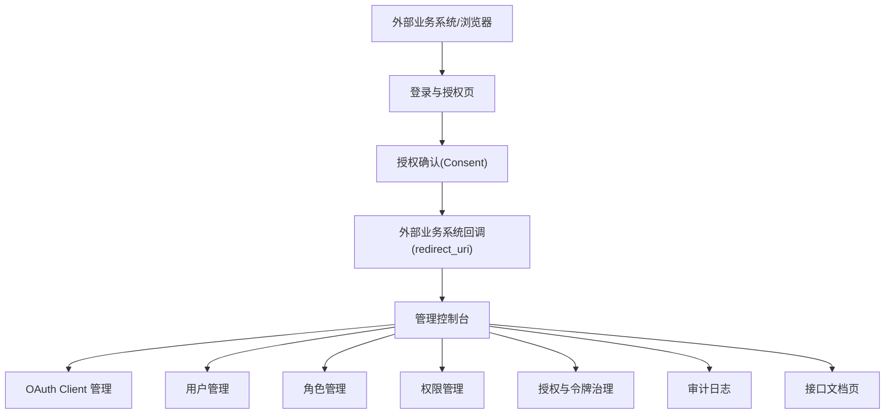

## 1. Product Overview
面向企业内部管理后台的“前后端分离单体 IAM”，基于 Spring Authorization Server 提供 OAuth2.1 认证授权与 JWT 资源访问。
你可以在同一套后台中完成应用接入（Client）、用户/角色/权限（RBAC）治理，并以 Redis 支撑会话与令牌相关能力。

交付物（最小可用）：
- 可运行的后端单体服务（Auth Server + Resource Server）与 Vue3 管理端
- OpenAPI/Swagger 接口文档与统一错误码/响应结构
- 初始化 SQL（RBAC + OAuth Client 示例数据）与环境配置说明

## 2. Core Features

### 2.1 User Roles
| 角色 | 创建/加入方式 | 核心权限 |
|------|---------------|----------|
| 系统管理员 | 由系统初始化账号或管理员创建 | 管理 OAuth Client、用户/角色/权限、系统参数、审计日志 |
| 安全审计员 | 管理员授予角色 | 只读查看用户、授权记录、审计日志 |
| 业务用户 | 管理员创建/导入 | 登录、发起授权、访问已授权资源 |

### 2.2 Feature Module
本项目最小可用需求包含以下主要页面：
1. **登录与授权页**：账号密码登录、授权确认（Consent）、错误提示。
2. **管理控制台**：OAuth Client 管理、用户管理、角色管理、权限管理、授权与审计查询。
3. **接口文档页**：在线查看 API（OpenAPI/Swagger）、复制请求示例。

### 2.3 Page Details
| Page Name | Module Name | Feature description |
|-----------|-------------|---------------------|
| 登录与授权页 | 登录表单 | 完成账号密码登录；提示校验错误与锁定/禁用状态；登录成功跳转授权或控制台 |
| 登录与授权页 | 授权确认(Consent) | 展示申请方(Client)与申请的 scope；允许同意/拒绝；返回标准错误码 |
| 登录与授权页 | 登录态处理 | 记住登录状态（基于 Redis）；退出登录并清理会话 |
| 管理控制台 | 全局导航与鉴权 | 基于 RBAC 控制菜单可见性与按钮权限；无权限给出提示并可跳转 |
| 管理控制台 | OAuth Client 管理 | 新增/编辑/禁用 Client；配置 redirect_uri、scopes、token 有效期策略；生成/重置 client_secret（仅展示一次） |
| 管理控制台 | 用户管理 | 新增/编辑/禁用用户；重置密码；为用户分配角色；查看用户最近登录与授权记录 |
| 管理控制台 | 角色管理 | 新增/编辑/删除角色（受保护）；为角色配置权限集合；查看角色关联用户 |
| 管理控制台 | 权限管理 | 维护权限点（API/按钮/菜单）；定义权限编码与描述；用于前端与后端一致校验 |
| 管理控制台 | 授权与令牌治理 | 查询某用户对某 Client 的授权；撤销授权；对 JWT 进行吊销/黑名单（Redis） |
| 管理控制台 | 审计日志 | 记录登录、授权、配置变更等关键事件；支持分页与条件筛选 |
| 接口文档页 | API 浏览 | 展示接口分组、参数、响应与错误码；支持复制 curl/JSON 示例 |

## 3. Core Process
- 业务用户流程：访问业务系统 → 跳转到统一登录 → 登录成功后进入授权确认（如需）→ 业务系统换取 token → 携带 JWT 访问资源接口。
- 系统管理员流程：登录控制台 → 创建/配置 OAuth Client → 维护用户/角色/权限 → 通过审计与授权查询定位问题 → 必要时撤销授权或吊销令牌。

