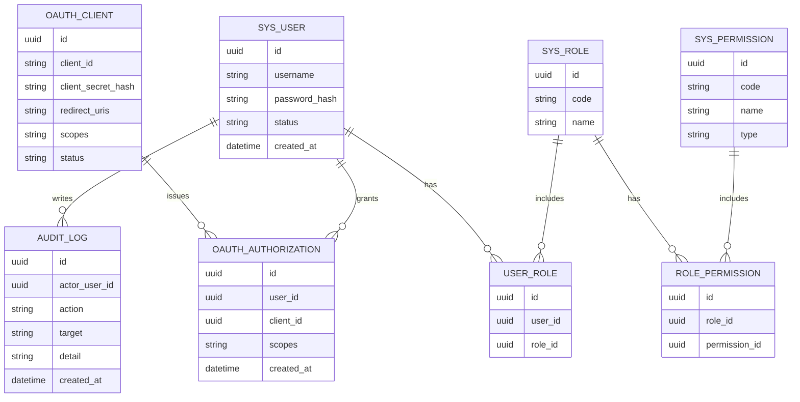

## 1.Architecture design
```mermaid
graph TD
  A["User Browser"] --> B["Vue3 Admin SPA"]
  B --> C["Spring Boot Monolith"]
  C --> D["Spring Authorization Server"]
  C --> E["Resource API (RBAC/Admin APIs)"]
  C --> F["PostgreSQL"]
  C --> G["Redis"]

  subgraph "Frontend Layer"
    B
  end

  subgraph "Backend Layer"
    C
    D
    E
  end

  subgraph "Data Layer"
    F
    G
  end
end
```

## 2.Technology Description
- Frontend: Vue@3 + TypeScript + vite + vue-router + pinia + axios + element-plus(或同类组件库)
- Backend: Spring Boot@3 + Spring Security@6 + Spring Authorization Server + Validation
- Database: PostgreSQL
- Cache: Redis（登录会话、授权流程临时数据、JWT 吊销/黑名单、限流/防刷可选）

## 3.Route definitions
| Route | Purpose |
|-------|---------|
| /login | 登录入口（如需可承载授权页的登录） |
| /consent | OAuth 授权确认页（同意/拒绝 scope） |
| /console | 控制台首页/概览与快捷入口 |
| /console/clients | OAuth Client 管理 |
| /console/users | 用户管理 |
| /console/roles | 角色管理 |
| /console/permissions | 权限管理 |
| /console/audit | 审计日志 |
| /docs | 在线接口文档（Swagger UI） |

## 4.API definitions
### 4.1 统一响应与分页（业务 API）
TypeScript 类型（前后端约定）：
```ts
type ApiResp<T> = { code: string; message: string; data: T; traceId?: string };

type PageReq = { page: number; pageSize: number };

type PageResp<T> = { items: T[]; page: number; pageSize: number; total: number };
```

错误码约定（示例）：
- AUTH_UNAUTHORIZED / AUTH_FORBIDDEN
- VALIDATION_ERROR
- RESOURCE_NOT_FOUND
- CONFLICT_DUPLICATE

### 4.2 OAuth2.1 端点（由 Spring Authorization Server 提供）
- GET /oauth2/authorize（授权码流程）
- POST /oauth2/token（换取 token）
- POST /oauth2/revoke（吊销 token）
- POST /oauth2/introspect（可选：仅在需要不透明 token 或内部校验时启用）

JWT 建议：
- access_token: JWT（短时效）
- refresh_token: 建议启用并配合 Redis/DB 进行轮换与失效管理

### 4.3 RBAC 管理 API（Resource Server）
- 用户
  - GET /api/users?page&pageSize&keyword
  - POST /api/users
  - PATCH /api/users/{id}
  - POST /api/users/{id}/reset-password
  - PUT /api/users/{id}/roles
- 角色
  - GET /api/roles
  - POST /api/roles
  - PATCH /api/roles/{id}
  - DELETE /api/roles/{id}
  - PUT /api/roles/{id}/permissions
- 权限
  - GET /api/permissions
  - POST /api/permissions
  - PATCH /api/permissions/{id}
- OAuth Client
  - GET /api/clients
  - POST /api/clients
  - PATCH /api/clients/{id}
  - POST /api/clients/{id}/reset-secret
- 授权与审计
  - GET /api/authorizations?userId&clientId
  - DELETE /api/authorizations/{id}（撤销授权）
  - POST /api/tokens/revoke（按 token/jti 吊销，写入 Redis）
  - GET /api/audit-logs?page&pageSize&action&actor&timeRange

## 5.Server architecture diagram
```mermaid
graph TD
  A["Vue3 Client"] --> B["Controller Layer (REST)"]
  B --> C["Security Layer (Spring Security + SAS)"]
  C --> D["Service Layer"]
  D --> E["Repository/DAO Layer"]
  E --> F["PostgreSQL"]
  D --> G["Redis"]

  subgraph "Spring Boot Monolith"
    B
    C
    D
    E
  end
end
```

## 6.Data model(if applicable)
### 6.1 Data model definition


### 6.2 Data Definition Language
```sql
CREATE TABLE sys_user (
  id UUID PRIMARY KEY,
  username VARCHAR(64) UNIQUE NOT NULL,
  password_hash VARCHAR(255) NOT NULL,
  status VARCHAR(16) NOT NULL,
  created_at TIMESTAMPTZ NOT NULL DEFAULT NOW()
);

CREATE TABLE sys_role (
  id UUID PRIMARY KEY,
  code VARCHAR(64) UNIQUE NOT NULL,
  name VARCHAR(64) NOT NULL
);

CREATE TABLE sys_permission (
  id UUID PRIMARY KEY,
  code VARCHAR(128) UNIQUE NOT NULL,
  name VARCHAR(128) NOT NULL,
  type VARCHAR(16) NOT NULL
);

CREATE TABLE user_role (
  id UUID PRIMARY KEY,
  user_id UUID NOT NULL,
  role_id UUID NOT NULL
);

CREATE TABLE role_permission (
  id UUID PRIMARY KEY,
  role_id UUID NOT NULL,
  permission_id UUID NOT NULL
);

CREATE TABLE oauth_client (
  id UUID PRIMARY KEY,
  client_id VARCHAR(128) UNIQUE NOT NULL,
  client_secret_hash VARCHAR(255) NOT NULL,
  redirect_uris TEXT NOT NULL,
  scopes TEXT NOT NULL,
  status VARCHAR(16) NOT NULL
);

CREATE TABLE oauth_authorization (
  id UUID PRIMARY KEY,
  user_id UUID,
  client_id UUID,
  scopes TEXT NOT NULL,
  created_at TIMESTAMPTZ NOT NULL DEFAULT NOW()
);

CREATE TABLE audit_log (
  id UUID PRIMARY KEY,
  actor_user_id UUID,
  action VARCHAR(64) NOT NULL,
  target VARCHAR(128),
  detail TEXT,
  created_at TIMESTAMPTZ NOT NULL DEFAULT NOW()
);
```

交付物补充（技术侧）：
- OpenAPI/Swagger：/docs + /v3/api-docs
- Postman/Apifox 集合（可选但推荐）
- Redis Key 规范说明（jti 黑名单、会