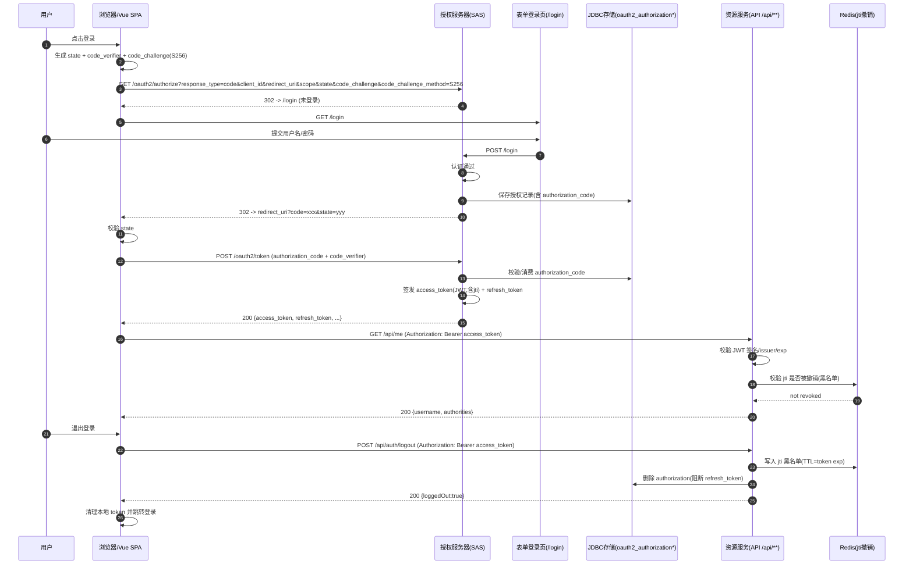

# OAuth2.1 授权码 + PKCE 认证时序图（对齐本仓库实现）

```mermaid
sequenceDiagram
  autonumber
  participant U as 用户
  participant SPA as 浏览器/Vue SPA
  participant AS as 授权服务器(SAS)
  participant LP as 表单登录页(/login)
  participant DB as JDBC存储(oauth2_authorization*)
  participant RS as 资源服务(API /api/**)
  participant Redis as Redis(jti撤销)

  U->>SPA: 点击登录
  SPA->>SPA: 生成 state + code_verifier + code_challenge(S256)
  SPA->>AS: GET /oauth2/authorize?response_type=code&client_id&redirect_uri&scope&state&code_challenge&code_challenge_method=S256
  AS-->>SPA: 302 -> /login (未登录)

  SPA->>LP: GET /login
  U->>LP: 提交用户名/密码
  LP->>AS: POST /login
  AS->>AS: 认证通过
  AS->>DB: 保存授权记录(含 authorization_code)
  AS-->>SPA: 302 -> redirect_uri?code=xxx&state=yyy

  SPA->>SPA: 校验 state
  SPA->>AS: POST /oauth2/token (authorization_code + code_verifier)
  AS->>DB: 校验/消费 authorization_code
  AS->>AS: 签发 access_token(JWT,含jti) + refresh_token
  AS-->>SPA: 200 {access_token, refresh_token, ...}

  SPA->>RS: GET /api/me (Authorization: Bearer access_token)
  RS->>RS: 校验 JWT 签名/issuer/exp
  RS->>Redis: 校验 jti 是否被撤销(黑名单)
  Redis-->>RS: not revoked
  RS-->>SPA: 200 {username, authorities}

  U->>SPA: 退出登录
  SPA->>RS: POST /api/auth/logout (Authorization: Bearer access_token)
  RS->>Redis: 写入 jti 黑名单(TTL=token exp)
  RS->>DB: 删除 authorization(阻断 refresh_token)
  RS-->>SPA: 200 {loggedOut:true}
  SPA->>SPA: 清理本地 token 并跳转登录
```

